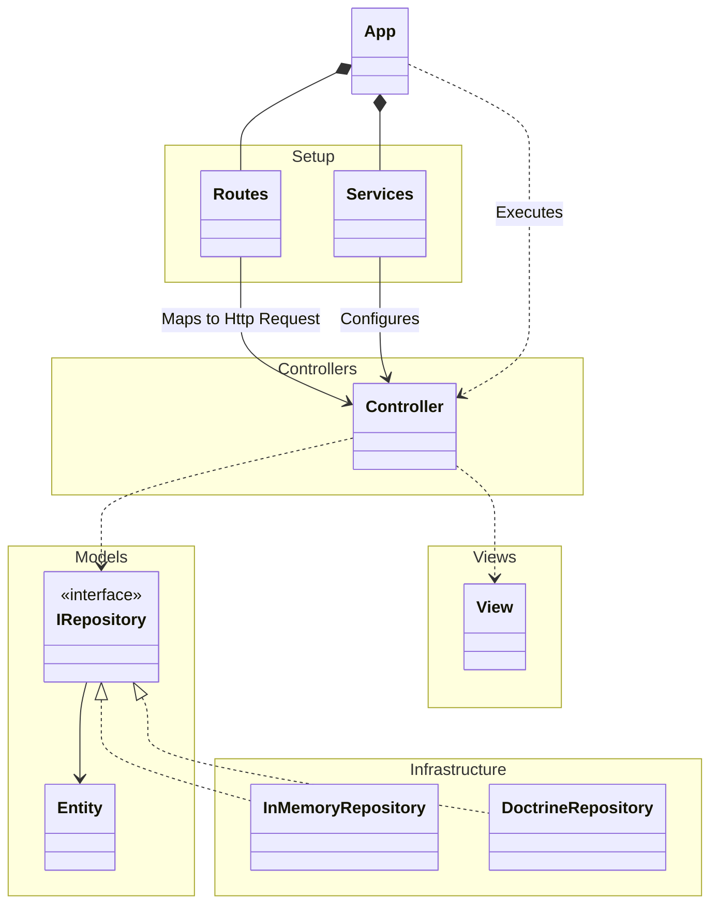
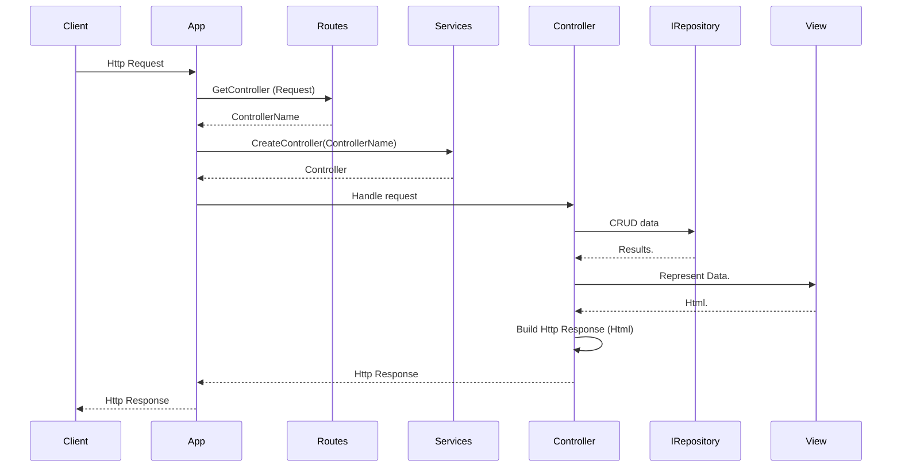

# merkatodo-esp-uniminuto

```mermaid
classDiagram

namespace Models { 
    class Entity
    class IRepository
}

namespace Infrastructure {
    class InMemoryRepository
    class DoctrineRepository
}

namespace Views {
    class View
}

namespace Controllers {
    class Controller
}

namespace Setup {
    class Routes
    class Services
}

class App

<<interface>> IRepository
IRepository <|.. InMemoryRepository
IRepository <|.. DoctrineRepository
IRepository --> Entity
Controller ..> IRepository
Controller ..> View
Routes --> Controller: Maps to Http Request
Services --> Controller: Configures
App *-- Routes
App *-- Services
App ..> Controller: Executes
```
Backend class Diagram

```mermaid
sequenceDiagram
    Client ->> App: Http Request
    App ->> Routes: GetController (Request)
    Routes -->> App: ControllerName
    App ->> Services: CreateController(ControllerName)
    Services -->> App: Controller
    App ->> Controller: Handle request
    Controller ->> IRepository: CRUD data
    IRepository -->> Controller: Results.
    Controller ->> View: Represent Data.
    View -->> Controller: Html.
    Controller ->> Controller: Build Http Response (Html)
    Controller -->> App: Http Response
    App -->> Client:Http Response
```
Backend sequence Diagram